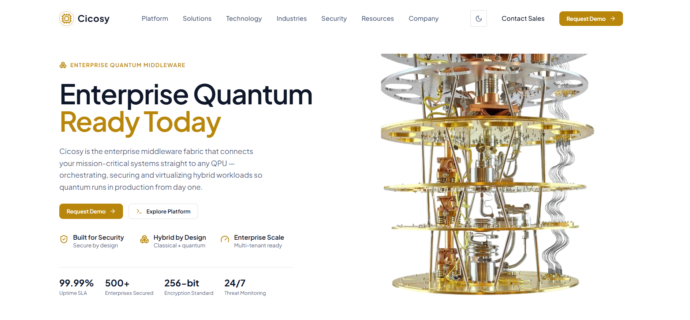
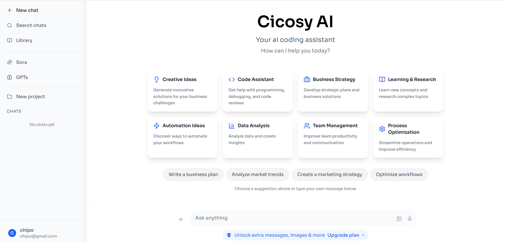
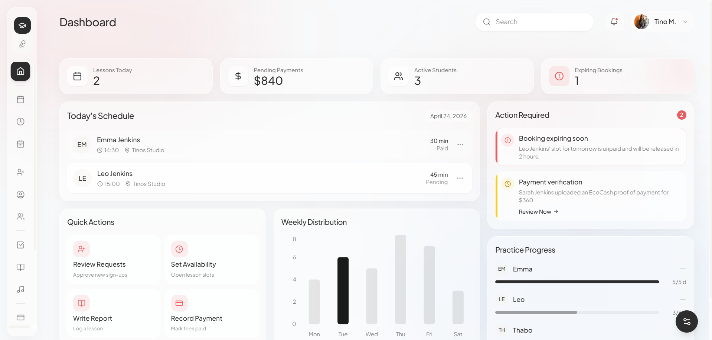
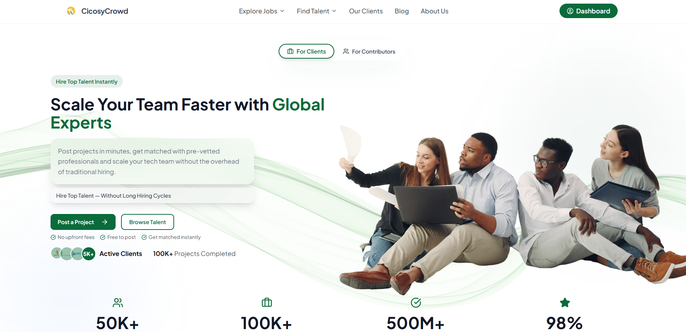
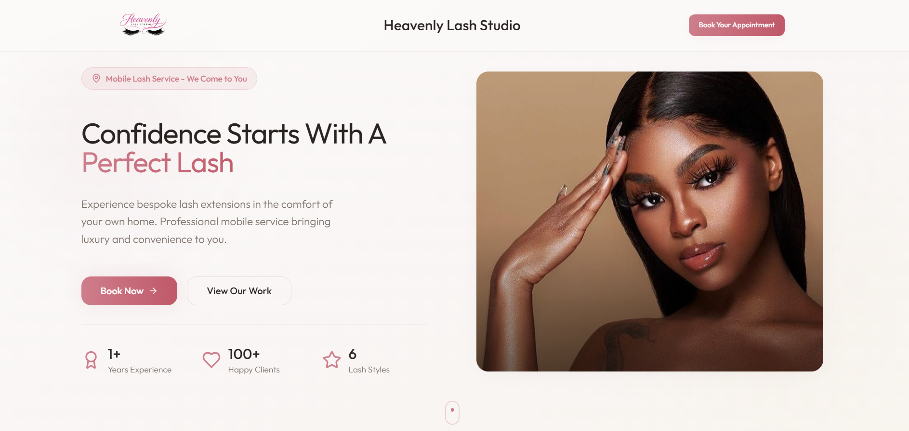

<h1 align="center">Hi, I'm Chipo Audrey Sithole 👋</h1>

  

  
  
  

---

## 🧑‍💻 About Me

I'm a **Frontend Developer** based in **Harare, Zimbabwe**, passionate about turning ideas into clean,
responsive, and accessible web experiences. I build modern interfaces with **React**, **TypeScript**,
and **Tailwind CSS**, and I'm comfortable reaching into the backend with **Python** when a project needs it.

- 🔭 Currently building web platforms at **ACS Foundation**
- 🌱 Always leveling up — deepening my skills in modern React patterns, UI/UX, and full-stack development
- 💡 I love working on real-world products: management systems, AI-powered platforms, and crowdsourcing tools
- 🌍 Portfolio → **[chipo-sithole.vercel.app](https://chipo-sithole.vercel.app/)**
- 📫 Reach me at **audreysitholep09@gmail.com**

---

## 🛠️ Tech Stack

**Languages**

**Frameworks & Libraries**

**Tools & Platforms**

---

## 🚀 Featured Projects

<!--
  📸 HOW TO ADD YOUR REAL SCREENSHOTS:
  1. Take a screenshot of each app.
  2. Upload the image files into the "assets" folder of this repo
     (drag & drop via GitHub's web UI, or add them to /assets and commit).
     Suggested names: quantum.png, cicosy-ai.png, violin-studio.png, crowdsourcing.png, lash-luxe.png
  3. Replace each placeholder image URL below (the https://placehold.co/... link)
     with the path to your image, e.g.  ./assets/quantum.png
-->

### 🌌 Quantum

A modern web application built with a focus on clean UI and seamless user experience.

  

**Built with:** `TypeScript` · `React` · `Tailwind CSS`

 

### 🤖 Cicosy AI Assistant Platform

An AI-powered assistant platform delivering intelligent, conversational experiences to users.

  

**Built with:** `TypeScript` · `React` · `AI Integration`

 

### 🎻 Ms Tino's Violin Studio Management System

A management system for a violin studio — handling students, lesson scheduling, and studio operations in one place.

  

**Built with:** `TypeScript` · `React`

 

### 🌍 Crowdsourcing Platform

A web platform for collecting and managing crowdsourced data and contributions from a community of users. **[View repo →](https://github.com/Chipo-Sithole/crowdsourcing)**

  

**Built with:** `TypeScript` · `React`

 

### 💅 Lash Suite Luxe

A sleek booking and management application for a lash & beauty studio, streamlining appointments and client management.

  

**Built with:** `TypeScript` · `React`

---

## 🌐 Connect With Me

  
  
  
  

---

  

<i>✨ Thanks for stopping by — let's build something great together!</i>

